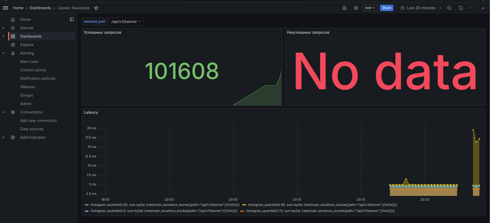

# [Главная](../README.md)

# Мониторинг

В сервис добавлены сборщик метрик `Prometheus` и система визуализации `Grafana`. С помощью этих служб можно следить
за состоянием сервиса и проверять соответствует ли работоспособность сервиса по различным требованиям. Ниже приведён пример
дашборда графаны, описывающий состояние сервиса во время проведения нагрузочного теста:

При запуске сервиса с нуля данный дашборд можно загрузить из папки `md/grafana`.