# [Главная](../README.md)

# Нагрузочное тестирование

Проводилось тестирование двух методов получения `/user_banner` и `/banner`, т.к. из условия 
предполагается, что основная нагрузка на get запросы. 

# Параметры тестирования

Перед запуском тестирования база данных была заполнена скриптом из пакета `loadtest/generate`.

Для тестирования использовалась утилита [Grafana k6 documentation](https://grafana.com/docs/k6/latest/).

## Виды тестов

База была заполнения в двух версиях:
* **Базовый тест** С количеством тэгов и фичей по 1000 каждый. Количество баннеров равнялось 8000.
* **Повышенный тест** С количеством тэгов и фичей по 2000 каждый. Количество баннеров равнялось 16000.

Дополнительно для `/banner` выделено два вида тестов: 
- Тест с указанием фич и тэга вместе
- Тест со всеми вариантами присутствия фич и тэгов в запросе.

Каждый тест проводился по три раза и сохранялся лучший результат. Тест каждого метода состоял из трёх тестов:
- Тест с низкой нагрузкой ~200 запросов в секунду
- Тест с ожидаемой нагрузкой ~1000 запросов в секунду
- Тест с повышенной нагрузкой ~2000 запросов в секунду

Grafana k6 поваляет указать требования к ответом сервиса во время тестирования. Так были установлены
ограничения на время ответа для 99 процентили меньше или равно 50 мс и количество успешных ответов более 99,99%.

## Окружение

Система запускалась в релиз версии, согласно инструкции из раздела [Главная](../README.md).

Тесты запускались на системе со следующими характеристиками:

- OS: Linux Mint 21.3 Virginia
- CPU: Intel(R) Core(TM) i7-9750H CPU @ 2.60GHz
- RAM: SO-DIMM DDR4 16 GB
- SSD: Kingston model: RBUSNS8154P3512GJ1 speed: 15.8 Gb/s

# Тесты

## Базовый `/user_banner`

### Тест с низкой нагрузкой

Результаты тестирования:

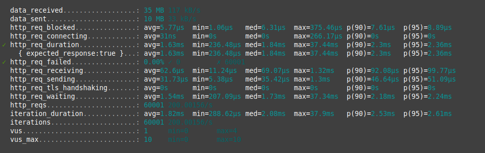

По результатом нагрузка составила 200 запросов в секудну. Время ответа по 95 процентили составило
2,36 мс.

### Тест с ожидаемой нагрузкой

Результаты тестирования:

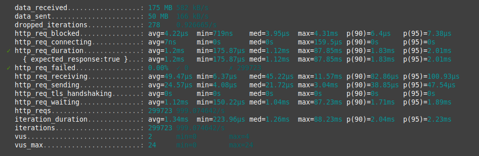

По результатом нагрузка составила 999 запросов в секудну. Время ответа по 95 процентили составило
2,01 мс.

### Тест с повышенной нагрузкой

Результаты тестирования:

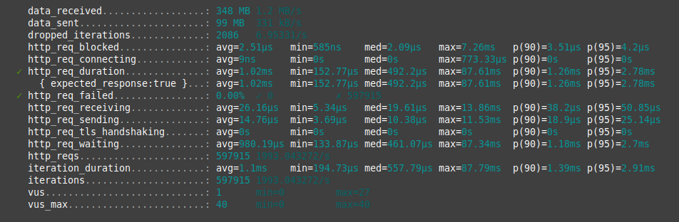

По результатом нагрузка составила 1993 запросов в секудну. Время ответа по 95 процентили составило
2,78 мс.

### Итоги

При базовом количестве фич и тэгов, сервис по запросам на метод `/user_banner` поддерживает
SLI на время ответа 50 мс и SLI на успешность ответов 99.99%. 

## Повышенный `/user_banner`

### Тест с низкой нагрузкой

Результаты тестирования:

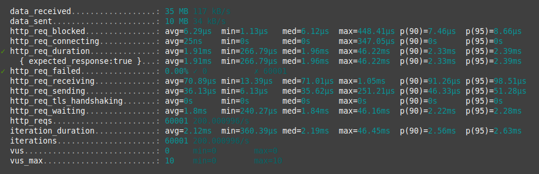

По результатом нагрузка составила 200 запросов в секудну. Время ответа по 95 процентили составило
2,39 мс.

### Тест с ожидаемой нагрузкой

Результаты тестирования:

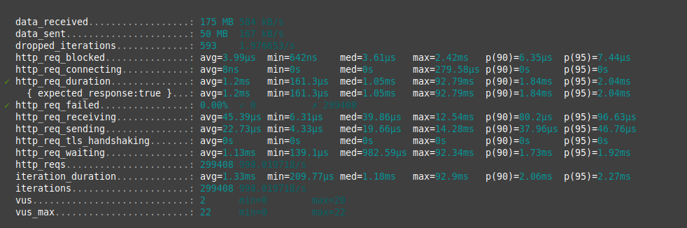

По результатом нагрузка составила 998 запросов в секудну. Время ответа по 95 процентили составило
2,04 мс.

### Тест с повышенной нагрузкой

Результаты тестирования:

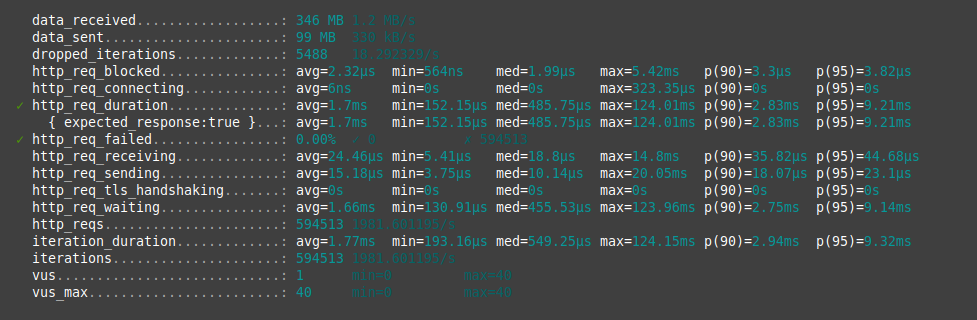

По результатом нагрузка составила 1974 запросов в секудну. Время ответа по 95 процентили составило
934 мкс.

### Итоги

При повышенном количестве фич и тэгов, сервис по запросам на метод `/user_banner` поддерживает
SLI на время ответа 50 мс и SLI на успешность ответов 99.99%.

## Базовый `/banner` с идентификаторами фич и тэгов вместе

### Тест с низкой нагрузкой

Результаты тестирования:

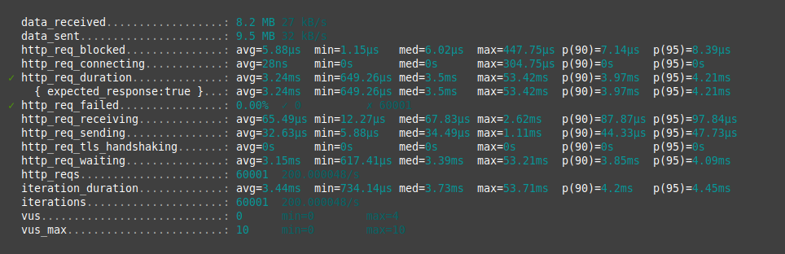

По результатом нагрузка составила 200 запросов в секудну. Время ответа по 95 процентили составило
4,21 мс.

### Тест с ожидаемой нагрузкой

Результаты тестирования:

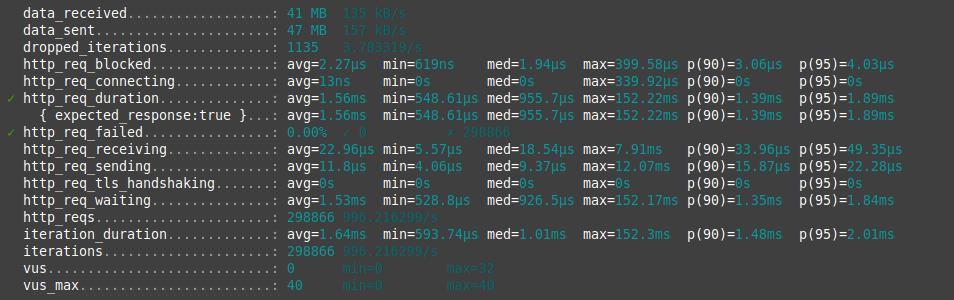

По результатом нагрузка составила 996 запросов в секудну. Время ответа по 95 процентили составило
1,89 мс.

### Тест с повышенной нагрузкой

Результаты тестирования:

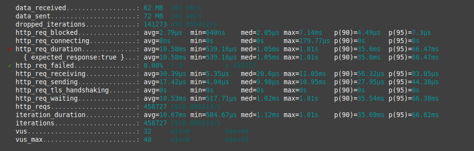

По результатом нагрузка составила 1528 запросов в секудну. Время ответа по 95 процентили составило
66.47 мс.

### Итоги

При базовом количестве фич и тэгов, сервис по запросам на метод `/banner`  с идентификаторами фич и тэгов вместе
поддерживает SLI на время ответа 50 мс и SLI на успешность ответов 99.99% только при ожидаемой нагрузке и ниже.

## Повышенный `/banner` с идентификаторами фич и тэгов вместе 

### Тест с низкой нагрузкой

Результаты тестирования:

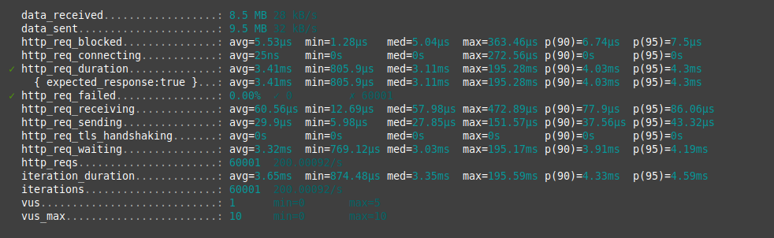

По результатом нагрузка составила 200 запросов в секудну. Время ответа по 95 процентили составило
4.3 мс.

### Тест с ожидаемой нагрузкой

Результаты тестирования:

По результатом нагрузка составила 994 запросов в секудну. Время ответа по 95 процентили составило
1,95 мс.

### Тест с повышенной нагрузкой

Результаты тестирования:

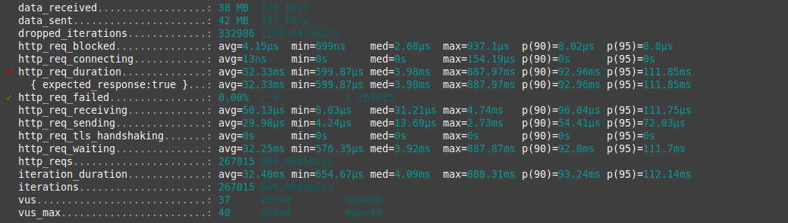

По результатом нагрузка составила 889 запросов в секудну. Время ответа по 95 процентили составило
111.85 мс.

### Итоги

При повышенном количестве фич и тэгов, сервис по запросам на метод `/banner`  с идентификаторами фич и тэгов вместе
поддерживает SLI на время ответа 50 мс и SLI на успешность ответов 99.99% только при ожидаемой нагрузке и ниже.

## Базовый `/banner` с любой комбинацией идентификаторов фич и тэгов

### Тест с низкой нагрузкой

Результаты тестирования:

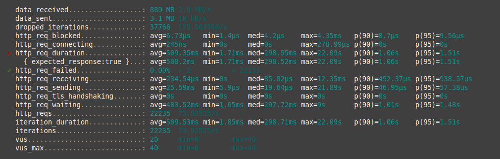

По результатом нагрузка составила 73 запросов в секудну. Время ответа по 95 процентили составило
1,51 с.

Проверять на большой нагрузке не имеет смысла, т.к. сервис уже не успевает для проверенной нагрузки.

### Итоги

При базовом количестве фич и тэгов, сервис по запросам на метод `/banner`  с любой комбинацией идентификаторов фич и тэгов
не поддерживает SLI на время ответа 50 мс и SLI на успешность ответов 99.99%

## Повышенный `/banner` с любой комбинацией идентификаторов фич и тэгов

### Тест с низкой нагрузкой

Результаты тестирования:

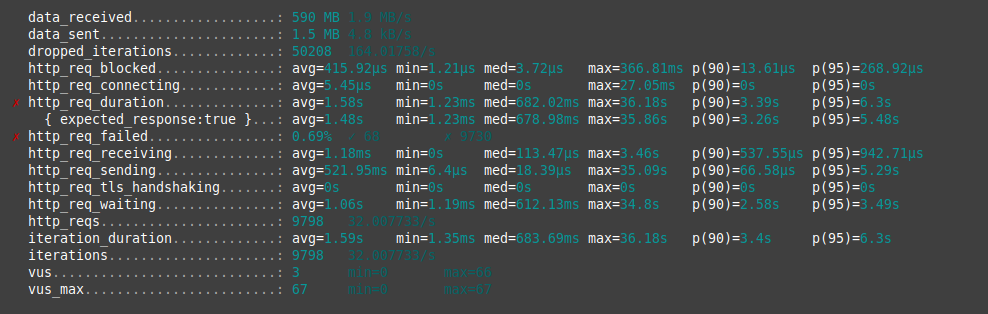

По результатом нагрузка составила 32 запросов в секудну. Время ответа по 95 процентили составило
5,48 с.

Проверять на большой нагрузке не имеет смысла, т.к. сервис уже не успевает для проверенной нагрузки.

### Итоги

При базовом количестве фич и тэгов, сервис по запросам на метод `/banner`  с любой комбинацией идентификаторов фич и тэгов
не поддерживает SLI на время ответа 50 мс и SLI на успешность ответов 99.99%

# Проблемы выявленные во время тестов

## Первая проблема

### Долгий ответ сервера

Сервер долга отвечает на запросы, и с трудом успевает обрабатывать 100 запросов в секунду.

### Причина и решение

Сервер долго отвечал из-за установленного в 0 значения максимального числа соединений с PostgreSQL, из-за
чего сервер каждый раз создавал новое соединение.

Для решение проблемы были добавлены настройки максимального числа подключений, максимального число бездействующих подключений
и время жизни бездействующего соединения сверх лимита.

## Вторая проблема

### Огромный расход памяти

В ходе тестирования система и контейнер prometheus начинали в геометрической прогрессии использовать оперативную память.

### Причина и решение

Для проверки использования памяти был добавлен обработчик pprof. Через него удалось выяснить, что при сохранении метрик
на каждый запрос выделяется новая метрика и группа леблов. По итогу оказалось, что по ошибке в качестве лейбла метрики
добавлялся путь вместе с параметрами запроса, что заставляло создавать новые группы лейблов.

Для решения была исправлена ошибка и в качестве лайбла пути метода стал использоваться путь роута gin.