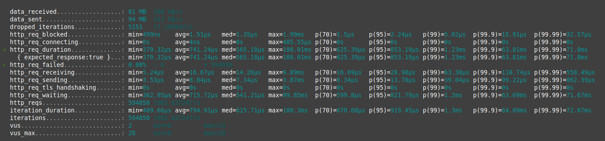
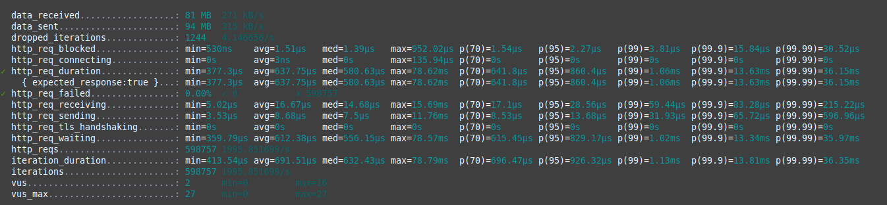
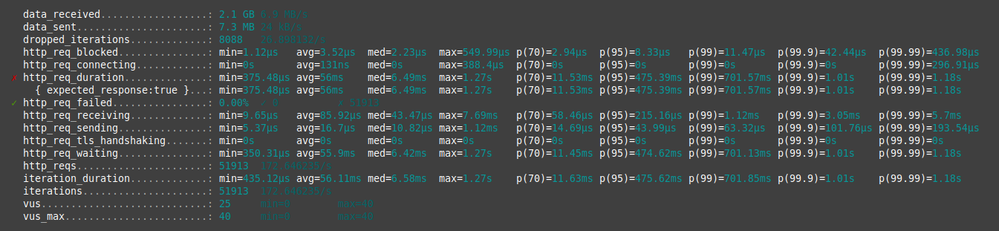
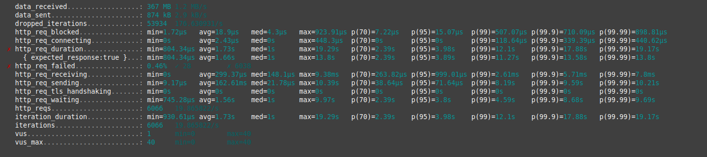

# [Главная](../README.md)

# Нагрузочное тестирование

Проводилось тестирование двух методов получения `/user_banner` и `/banner`, т.к. из условия 
предполагается, что основная нагрузка на get запросы. 

## Параметры тестирования

Перед запуском тестирования база данных была заполнена скриптом из пакета `loadtest/generate`.

Для тестирования использовалась утилита [Grafana k6 documentation](https://grafana.com/docs/k6/latest/).

## Виды тестов

База была заполнения в двух версиях:
* **Базовый тест** С количеством тэгов и фичей по 1000 каждый. Количество баннеров равнялось 8000.
* **Повышенный тест** С количеством тэгов и фичей по 2000 каждый. Количество баннеров равнялось 16000.

Дополнительно для `/banner` выделено два вида тестов: 
- Тест с указанием фич и тэга вместе
- Тест со всеми вариантами присутствия фич и тэгов в запросе.

Каждый тест проводился по три раза и сохранялся лучший результат. Тест каждого метода состоял из трёх тестов:
- Тест с низкой нагрузкой ~200 запросов в секунду
- Тест с ожидаемой нагрузкой ~1000 запросов в секунду
- Тест с повышенной нагрузкой ~2000 запросов в секунду

Grafana k6 позволяет указать требования к ответам сервиса во время тестирования в опциях. Так были установлены
проверки на время ответа для 99 перцентили меньше 50 мс и на количество неуспешных ответов меньше 0,01% от
общего числа запросов. Конфигурации тестов находятся в папке loadtest.

```js
thresholds: {
    // количество запрсоов завершивщихся с ошибкой должно быть меньше чем 0.01% от общего числа
    http_req_failed: ['rate<0.0001'],
    http_req_duration: ['p(99)<50'], // 99% запросов должны завершиться менее чем 50 мс
},
```

**На скринах с результатами тестов слева от параметров `http_req_failed` и `http_req_duration` будет стоять галочка или 
крестить в зависимости от верности описанных выше ограничений.**

Пример запуска тестов:

```bash
k6 run --summary-trend-stats "min,avg,med,max,p(70),p(95),p(99),p(99.99)" ./loadtest/user_banner_test.js -e INFO_FILE=./info_basic.json -e RATE_COUNT=2000
```

## Окружение

Система запускалась в релиз версии, согласно инструкции из раздела [Главная](../README.md).

Тесты запускались на системе со следующими характеристиками:

- OS: Linux Mint 21.3 Virginia
- CPU: Intel(R) Core(TM) i7-9750H CPU @ 2.60GHz
- RAM: SO-DIMM DDR4 16 GB
- SSD: Kingston model: RBUSNS8154P3512GJ1 speed: 15.8 Gb/s

# Тесты

## Базовый `/user_banner`

### Тест с низкой нагрузкой

Результаты тестирования:
                                    
| Характеристика                   |  Первая   |    Вторая    |  Третья   |
|----------------------------------|:---------:|:------------:|:---------:|
| Время ответа по 99,99 перцентили |  5,31 мс  |   5,72 мс    |  5,64 мс  |
| Число ответов с ошибкой          |    0 %    |     0 %      |    0 %    |
| RPS завершённых ответов          | 200 req/s | 199,99 req/s | 200 req/s |

Скрины результатов:

|                   Первый                    |
|:-------------------------------------------:|
|  |
|                 **Второй**                  |
|  |
|                 **Третий**                  |
|  |


Лучший результат составит **200** завершённых запросов в секунду и временем ответа по 99,99 перцентили -- **5,31 мс**.

### Тест с ожидаемой нагрузкой

Результаты тестирования:

| Характеристика                   |    Первая    |    Вторая    |    Третья    |
|----------------------------------|:------------:|:------------:|:------------:|
| Время ответа по 99,99 перцентили |   19,2 мс    |   14,22 мс   |   18,58 мс   |
| Число ответов с ошибкой          |     0 %      |     0 %      |     0 %      |
| RPS завершённых ответов          | 999,72 req/s | 999,82 req/s | 999,72 req/s |

Скрины результатов:

|                    Первый                     |
|:---------------------------------------------:|
|  |
|                  **Второй**                   |
|  |
|                  **Третий**                   |
|  |

Лучший результат составит **999,82** завершённых запросов в секунду и временем ответа по 99,99 перцентили -- **14,22 мс**.

### Тест с повышенной нагрузкой

Результаты тестирования:

| Характеристика                   |    Первая     |    Вторая     |    Третья     |
|----------------------------------|:-------------:|:-------------:|:-------------:|
| Время ответа по 99,99 перцентили |   22,14 мс    |   22,44 мс    |   18,99 мс    |
| Число ответов с ошибкой          |      0 %      |      0 %      |      0 %      |
| RPS завершённых ответов          | 1998,07 req/s | 1997,95 req/s | 1998,33 req/s |

Скрины результатов:

|                    Первый                    |
|:--------------------------------------------:|
|  |
|                  **Второй**                  |
|  |
|                  **Третий**                  |
|  |


Лучший результат составит **1998,33** завершённых запросов в секунду и временем ответа по 99,99 перцентили -- **18,99 мс**.

### Итоги

При базовом количестве фич и тэгов, сервис по запросам на метод `/user_banner` поддерживает
SLI на время ответа 50 мс для 99,99 перцентили и SLI на успешность ответов 99.99% как при ожидаемой так и при
повышенной нагрузке.

## Повышенный `/user_banner`

### Тест с низкой нагрузкой

Результаты тестирования:

| Характеристика                   |    Первая    |  Вторая   |  Третья   |
|----------------------------------|:------------:|:---------:|:---------:|
| Время ответа по 99,99 перцентили |   8,41 мс    |  8,8 мс   |  9,32 мс  |
| Число ответов с ошибкой          |     0 %      |    0 %    |    0 %    |
| RPS завершённых ответов          | 199,99 req/s | 200 req/s | 200 req/s |

Скрины результатов:

|                   Первый                    |
|:-------------------------------------------:|
|  |
|                 **Второй**                  |
|  |
|                 **Третий**                  |
|  |


Лучший результат составит **199,99** завершённых запросов в секунду и временем ответа по 99,99 перцентили -- **8,41 мс**.

### Тест с ожидаемой нагрузкой

Результаты тестирования:

| Характеристика                   |    Первая    |    Вторая    |    Третья    |
|----------------------------------|:------------:|:------------:|:------------:|
| Время ответа по 99,99 перцентили |   18,24 мс   |   18,35 мс   |   18,8 мс    |
| Число ответов с ошибкой          |     0 %      |     0 %      |     0 %      |
| RPS завершённых ответов          | 999,57 req/s | 999,77 req/s | 999,41 req/s |

Скрины результатов:

|                    Первый                     |
|:---------------------------------------------:|
|  |
|                  **Второй**                   |
|  |
|                  **Третий**                   |
|  |

Лучший результат составит **999,41** завершённых запросов в секунду и временем ответа по 99,99 перцентили -- **18,8 мс**.

### Тест с повышенной нагрузкой

Результаты тестирования:

| Характеристика                   |    Первая     |    Вторая     |    Третья     |
|----------------------------------|:-------------:|:-------------:|:-------------:|
| Время ответа по 99,99 перцентили |   23,88 мс    |   26,21 мс    |   22,95 мс    |
| Число ответов с ошибкой          |      0 %      |      0 %      |      0 %      |
| RPS завершённых ответов          | 1995,12 req/s | 1995,38 req/s | 1994,66 req/s |

Скрины результатов:

|                    Первый                    |
|:--------------------------------------------:|
|  |
|                  **Второй**                  |
|  |
|                  **Третий**                  |
|  |

Лучший результат составит **1994,66** завершённых запросов в секунду и временем ответа по 99,99 перцентили -- **22,95 мс**.

### Итоги

При повышенном количестве фич и тэгов, сервис по запросам на метод `/user_banner` поддерживает
SLI на время ответа 50 мс для 99,99 перцентили и SLI на успешность ответов 99.99% как при ожидаемой так и при
повышенной нагрузке.

## Базовый `/banner` с идентификаторами фич и тэгов вместе

### Тест с низкой нагрузкой

Результаты тестирования:

| Характеристика                   |    Первая    |  Вторая   |  Третья   |
|----------------------------------|:------------:|:---------:|:---------:|
| Время ответа по 99,99 перцентили |   9,41 мс    |  7,69 мс  |  5,28 мс  |
| Число ответов с ошибкой          |     0 %      |    0 %    |    0 %    |
| RPS завершённых ответов          | 199,99 req/s | 200 req/s | 200 req/s |

Скрины результатов:

|                 Первый                 |
|:--------------------------------------:|
|  |
|               **Второй**               |
|  |
|               **Третий**               |
|  |


Лучший результат составит **200** завершённых запросов в секунду и временем ответа по 99,99 перцентили -- **5,28 мс**.

### Тест с ожидаемой нагрузкой

Результаты тестирования:

| Характеристика                   |    Первая    |    Вторая    |    Третья    |
|----------------------------------|:------------:|:------------:|:------------:|
| Время ответа по 99,99 перцентили |   31,37 мс   |   34,16 мс   |   24,16 мс   |
| Число ответов с ошибкой          |     0 %      |     0 %      |     0 %      |
| RPS завершённых ответов          | 999,56 req/s | 999,54 req/s | 999,64 req/s |

Скрины результатов:

|                  Первый                  |
|:----------------------------------------:|
|  |
|                **Второй**                |
|  |
|                **Третий**                |
|  |

Лучший результат составит **999,64** завершённых запросов в секунду и временем ответа по 99,99 перцентили -- **24,16 мс**.

### Тест с повышенной нагрузкой

Результаты тестирования:

| Характеристика                   |    Первая     |    Вторая     |    Третья     |
|----------------------------------|:-------------:|:-------------:|:-------------:|
| Время ответа по 99,99 перцентили |   31,64 мс    |    71,8 мс    |   36,15 мс    |
| Число ответов с ошибкой          |      0 %      |      0 %      |      0 %      |
| RPS завершённых ответов          | 1996,46 req/s | 1982,83 req/s | 1995,85 req/s |

Скрины результатов:

|                 Первый                  |
|:---------------------------------------:|
|  |
|               **Второй**                |
|  |
|               **Третий**                |
|  |

Лучший результат составит **1996,46** завершённых запросов в секунду и временем ответа по 99,99 перцентили -- **31,64 мс**.

### Итоги

При базовом количестве фич и тэгов, сервис по запросам на метод `/banner`  с идентификаторами фич и тэгов вместе
поддерживает SLI на время ответа 50 мс для 99,99 перцентили и SLI на успешность ответов 99.99% как при ожидаемой так и при
повышенной нагрузке.

## Повышенный `/banner` с идентификаторами фич и тэгов вместе 

### Тест с низкой нагрузкой

Результаты тестирования:

| Характеристика                   |  Первая   |  Вторая   |  Третья   |
|----------------------------------|:---------:|:---------:|:---------:|
| Время ответа по 99,99 перцентили |  6,02 мс  |  5,79 мс  |  5,79 мс  |
| Число ответов с ошибкой          |    0 %    |    0 %    |    0 %    |
| RPS завершённых ответов          | 200 req/s | 200 req/s | 200 req/s |

Скрины результатов:

|                 Первый                 |
|:--------------------------------------:|
|  |
|               **Второй**               |
|  |
|               **Третий**               |
|  |


Лучший результат составит **200** завершённых запросов в секунду и временем ответа по 99,99 перцентили -- **5,79 мс**.

### Тест с ожидаемой нагрузкой

Результаты тестирования:

| Характеристика                   |    Первая    |    Вторая    |    Третья    |
|----------------------------------|:------------:|:------------:|:------------:|
| Время ответа по 99,99 перцентили |   33,82 мс   |   31,62 мс   |   32,09 мс   |
| Число ответов с ошибкой          |     0 %      |     0 %      |     0 %      |
| RPS завершённых ответов          | 998,88 req/s | 999,06 req/s | 999,11 req/s |

Скрины результатов:

|                  Первый                  |
|:----------------------------------------:|
|  |
|                **Второй**                |
|  |
|                **Третий**                |
|  |

Лучший результат составит **999,06** завершённых запросов в секунду и временем ответа по 99,99 перцентили -- **31,62 мс**.

### Тест с повышенной нагрузкой

Результаты тестирования:

| Характеристика                   |    Первая     |    Вторая     |    Третья     |
|----------------------------------|:-------------:|:-------------:|:-------------:|
| Время ответа по 99,99 перцентили |   28,52 мс    |   31,25 мс    |   35,25 мс    |
| Число ответов с ошибкой          |      0 %      |      0 %      |      0 %      |
| RPS завершённых ответов          | 1976,09 req/s | 1992,13 req/s | 1991,52 req/s |

Скрины результатов:

|                 Первый                  |
|:---------------------------------------:|
|  |
|               **Второй**                |
|  |
|               **Третий**                |
|  |

Лучший результат составит **1976,09** завершённых запросов в секунду и временем ответа по 99,99 перцентили -- **28,52 мс**.

### Итоги

При повышенном количестве фич и тэгов, сервис по запросам на метод `/banner`  с идентификаторами фич и тэгов вместе
поддерживает SLI на время ответа 50 мс для 99,99 перцентили и SLI на успешность ответов 99.99% как при ожидаемой так и при
повышенной нагрузке.

## Базовый `/banner` с любой комбинацией идентификаторов фич и тэгов

### Тест с низкой нагрузкой

Результаты тестирования:

| Характеристика                   |    Первая    |    Вторая    |    Третья    |
|----------------------------------|:------------:|:------------:|:------------:|
| Время ответа по 99,99 перцентили |   1180 мс    |  992,41 мс   |  786,92 мс   |
| Число ответов с ошибкой          |     0 %      |     0 %      |     0 %      |
| RPS завершённых ответов          | 172,65 req/s | 195,73 req/s | 197,66 req/s |

Скрины результатов:

|                   Первый                    |
|:-------------------------------------------:|
|  |
|                 **Второй**                  |
|  |
|                 **Третий**                  |
|  |

Лучший результат составит **197,66** завершённых запросов в секунду и временем ответа по 99,99 перцентили -- **786,92 мс**.
Для 95 перцентили время ответа -- 29,01.

### Тест с ожидаемой нагрузкой

Результаты тестирования:

| Характеристика                   |   Первая    |   Вторая    |   Третья    |
|----------------------------------|:-----------:|:-----------:|:-----------:|
| Время ответа по 99,99 перцентили |   1890 мс   |   1880 мс   |   1900 мс   |
| Число ответов с ошибкой          |     0 %     |     0 %     |     0 %     |
| RPS завершённых ответов          | 99,46 req/s | 99,39 req/s | 98,19 req/s |

Скрины результатов:

|                    Первый                     |
|:---------------------------------------------:|
|  |
|                  **Второй**                   |
|  |
|                  **Третий**                   |
|  |


Лучший результат составит **99,39** завершённых запросов в секунду и временем ответа по 99,99 перцентили -- **1880 мс**.

Проверять на большой нагрузке не имеет смысла, т.к. сервис уже не успевает обрабатывать запросы при проверенной нагрузки.

### Итоги

При базовом количестве фич и тэгов, сервис по запросам на метод `/banner`  с любой комбинацией идентификаторов фич и тэгов
не поддерживает SLI на время ответа 50 мс, но поддерживает SLI на успешность ответов 99.99%.

## Повышенный `/banner` с любой комбинацией идентификаторов фич и тэгов

Результаты тестирования:

| Характеристика                   |   Первая   |   Вторая    |   Третья    |
|----------------------------------|:----------:|:-----------:|:-----------:|
| Время ответа по 99,99 перцентили |  14700 мс  |  13800 мс   |  14410 мс   |
| Число ответов с ошибкой          |   0,6 %    |   0,46 %    |   0,37 %    |
| RPS завершённых ответов          | 19,5 req/s | 19,87 req/s | 20,15 req/s |

Скрины результатов:

|                   Первый                    |
|:-------------------------------------------:|
|  |
|                 **Второй**                  |
|  |
|                 **Третий**                  |
|  |

Лучший результат составит **19,87** завершённых запросов в секунду и временем ответа по 99,99 перцентили -- **13800 мс**. 
При этом 0,46 % ответов завершились с ошибкой связанной с таймаутом на ответ.

### Итоги

При базовом количестве фич и тэгов, сервис по запросам на метод `/banner`  с любой комбинацией идентификаторов фич и тэгов
не поддерживает SLI на время ответа 50 мс и SLI на успешность ответов 99.99%

# Итоги тестирования

Система соответствует требования SLI для основного метода получения баннера пользователем `/user_banner`. 
Для метода получения баннера админом, соответствует требования SLI, если запрашивается конкретный баннер (указан как 
id фичи так и id тэга).

В противном случае система для этого метода не соответствует SLI и с увеличением данных быстро ухудшается как время ответа
так и число успешных ответов. 

Т.к. значение требований по нагрузкам не указана для методов, можно предположить, что админы не будут создавать нагрузку
аналогичную создаваемой пользователями и готовы будут ждать дольше пользователя, следовательно, можно допустить, что 
система сможет выдержать реальные нагрузки.

Но для окончательного ответа на вопрос готовности системы к реальным нагрузкам необходимо провести нагрузочное 
тестирование уже с известной нагрузкой на каждый метод сервиса.

## Проблемы выявленные во время тестов

### Первая проблема

#### Долгий ответ сервера

Сервер долга отвечает на запросы, и с трудом успевает обрабатывать 100 запросов в секунду.

#### Причина и решение

Сервер долго отвечал из-за установленного в 0 значения максимального числа соединений с PostgreSQL, из-за
чего сервер каждый раз создавал новое соединение.

Для решение проблемы были добавлены настройки максимального числа подключений, минимального числа подключений
и время жизни бездействующего соединения.

### Вторая проблема

#### Огромный расход памяти

В ходе тестирования система и контейнер prometheus начинали в геометрической прогрессии использовать оперативную память.

#### Причина и решение

Для проверки использования памяти был добавлен обработчик pprof. Через него удалось выяснить, что при сохранении метрик
на каждый запрос выделяется новая метрика и группа леблов. По итогу оказалось, что по ошибке в качестве лейбла метрики
добавлялся путь вместе с параметрами запроса, что заставляло создавать новые группы лейблов.

Для решения была исправлена ошибка и в качестве лайбла пути метода стал использоваться путь роута gin.
